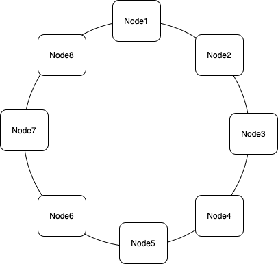

# **Gord-Overlay**
- [Gord](https://github.com/taisho6339/gord) is a reference implementation of [Chord protocol](https://pdos.csail.mit.edu/papers/ton:chord/paper-ton.pdf).
- **Gord-Overlay** is a fork of Gord which is enabled to run on overlay network constructed with [gossip-overlay lib](https://github.com/ryogrid/gossip-overlay)
  - Additionaly, offers on-memory KVS store functionality

---

## What is Gord-Overlay?
Gord-Overlay is a DHT based distribute key-value store.
Gord-Overlay will start as a REST server and your application can access data via REST.

## How is it work?
Gord-Overlay is an implementation of [DHT Chord](https://pdos.csail.mit.edu/papers/ton:chord/paper-ton.pdf) and simple key-value store using the DHT.
Chord protocol is an algorithm which extends consistent hashing.
Gord-Overlay server, using chord protocol, allocates a key to a node in distributed nodes ring.

 

In addition, servers communicate with each other via REST to synchronize route information.
Then, servers can query via REST to resolve server address and communicate with the server.

## Usage
- Gord-Overlay REST server reqires a hostname and port number pair
- If you specify 127.0.0.1:26000, the server will use 127.0.0.1:26000 to communication between other nodes and use 127.0.0.1:26001 to listen local REST request
- Specified hostname and port number pair is internally used as a node identifier, so you need to specify a unique pair for each node
- Additionaly, you need to specify address of a server which is already in the network to join the network except the first server

```
## Build
make build

## Check how to use this command
./gordolctl -h

## Start server
./gordolctl -l hostAndPort(required) -n existNodeHostAndPort(optional)
```

## Examples

1. Start servers
```bash
# start three server processes
docker-compose build && docker-compose up
```

2. Try! 
```bash
# Query
curl -X POST -H "Content-Type: application/json" -d '{"key": "gord1"}' http://localhost:26041/server.ExternalService/FindHostForKey \
&& curl -X POST -H "Content-Type: application/json" -d '{"key": "gord1"}' http://localhost:36041/server.ExternalService/FindHostForKey \
&& curl -X POST -H "Content-Type: application/json" -d '{"key": "gord1"}' http://localhost:46041/server.ExternalService/FindHostForKey 

curl -X POST -H "Content-Type: application/json" -d '{"key": "gord2"}' http://localhost:26041/server.ExternalService/FindHostForKey \
&& curl -X POST -H "Content-Type: application/json" -d '{"key": "gord2"}' http://localhost:36041 server.ExternalService/FindHostForKey \
&& curl -X POST -H "Content-Type: application/json" -d '{"key": "gord2"}' http://localhost:46041 server.ExternalService/FindHostForKey 

curl -X POST -H "Content-Type: application/json" -d '{"key": "gord"}' localhost:26041 server.ExternalService/FindHostForKey \
&& curl -X POST -H "Content-Type: application/json" -d '{"key": "gord"}' localhost:36041 server.ExternalService/FindHostForKey \
&& curl -X POST -H "Content-Type: application/json" -d '{"key": "gord"}' localhost:46041 server.ExternalService/FindHostForKey

# Put and Get value
curl -X POST -H "Content-Type: application/json" -d '{"key": "hoge", "value": "foobar"}' http://localhost:26041/server.ExternalService/PutValue
curl -X POST -H "Content-Type: application/json" -d '{"key": "hoge"}' http://localhost:36041/server.ExternalService/GetValue
curl -X POST -H "Content-Type: application/json" -d '{"key": "hoge"}' http://localhost:46041/server.ExternalService/GetValue
```

## How to build
```bash
make build
```

## How to run tests
```bash
make test
```
